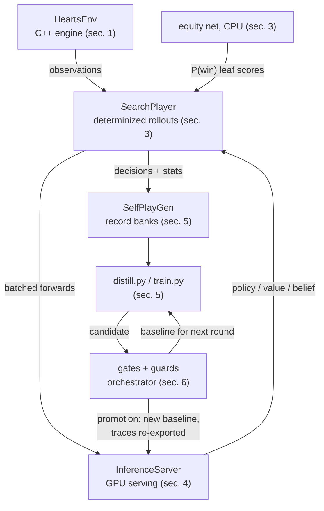

# ARCHITECTURE — the system

> STATUS: DRAFT - not yet released; project ongoing.

Derived overview of every component; source files are canonical
(docs/release/INDEX.md). File references are given loosely (file name,
sometimes a function); exact line numbers move.

## 0. Data flow at a glance

The system is one improvement loop. Components and arrows only —
sizes, counts, and rules live in the sections below.

## 1. Engine (HeartsEnv.hpp)

A header-only C++ Hearts engine: full rules (2♣ lead, no penalties on
trick 1 unless forced, hearts-breaking, shoot-the-moon scoring), the
passing phase (left/right/across/hold rotation), plus training-support
state: a per-seat void tracker, who-played-what attribution, and
play-order timing. Exposed to Python via pybind (hearts_env) and used
directly by the C++ players and generators.

### Observation layout — `HeartsEnv::Observe()` / `ObserveFor(seat)`

550 floats, all in [0,1], **prefix-stable across engine versions**
(older nets consume a prefix; `ProbeObsDim` in SearchPlayer.hpp probes
{550, 556, 238, 181} — 550 before 556, since a 550-trace would silently
accept 556 input while a 556 trace errors on 550).

Known fragility, stated for future maintainers: the probe list grows
with every observation revision, and each new length must be manually
ordered against every prefix-compatible older length or a smaller trace
silently truncates richer input. The next observation revision (the v6
surgery, docs/ROADMAP.md) should attach explicit obs-dim/version
metadata to exported traces and retire length probing, rather than
extend this list.

| Block | Dims | Indices | Content |
|---|---|---|---|
| 1 Hand | 52 | 0–51 | cards in the observing seat's hand |
| 2 Current trick | 52 | 52–103 | cards on the table |
| 3 History | 52 | 104–155 | cards no longer in any hand / on table |
| 4 Game context | 9 | 156–164 | round scores /26 (4), trick-position one-hot (4), hearts broken (1) |
| 5 Void tracker | 16 | 165–180 | seat x suit inferred voids |
| 6 Pass direction | 4 | 181–184 | one-hot (left/right/across/hold) |
| 7 In-passing flag | 1 | 185 | passing phase active |
| 8 Cards I passed | 52 | 186–237 | known cards in the receiver's hand |
| 9 Cards I received | 52 | 238–289 | known to the giver until played |
| 10 Who-played-what | 4x52 | 290–497 | per RELATIVE seat (me/left/across/right), incl. current trick |
| 11 Play timing | 52 | 498–549 | (trick_index+1)/13 for played cards |

### Match context — appended dims 550–555 (SearchPlayer::WriteCtx)

`[self, left, across, right] match totals /100` (rotated to the acting
seat), `deals_played /20`, `(100 − max_total) /100`. Written per ACTING
seat at every observation site inside search — scoring one seat's
decision with another seat's context is the failure mode this rule
prevents (docs/match_aware_search_design.md sec. 2).

## 2. Networks (hearts_net.py)

**HeartsNet (v1–v4 lineage):** flat MLP — 550 -> width pre-LN residual
trunk; policy head (52 logits, one per deck card — the same head serves
passing via the legality mask), scalar value head (relative round
reward: table average minus own score), auxiliary belief head (3x52
"does that opponent hold this card", trained supervised from self-play
ground truth, excluded from deployment traces), and an oracle value
head that sees the true opponent hands through a separate branch only
(no leakage into policy/value/belief) — built for determinized-search
leaf evaluation and measured useless (JOURNEY era 2).

**HeartsNetV5 — the card-token transformer** (class docstring,
hearts_net.py):
- Re-encodes the SAME 550-dim observation as **52 card tokens + 1
  global token**. Each card token = learned card-identity embedding +
  a linear projection of that card's 10 per-card channels sliced from
  the card-indexed observation blocks (hand, trick, history, passed,
  received, played-by x4, timing). The global token projects the 30
  context dims (156–185).
- Heads: policy = **one logit per card token** (the action space IS the
  card set); belief = 3 logits per card token; value from the global
  token.
- **Match conditioning:** a `match_proj` of the 6 appended context dims
  added to the global token, **zero-initialized** (weights and bias) so
  a net extended from a per-deal checkpoint is behavior-identical until
  training moves those weights; 550-dim callers skip the term entirely.
- Production size v5-M: d=320, L=6, 10 heads x head_dim 32, 7.6M params
  (a4136b5; docs/ROADMAP.md v6 spec lock note).
- Tracing hygiene, learned the hard way: explicit pre-LN attention
  blocks rather than nn.TransformerEncoder (whose runtime fast-path
  makes torch.jit.trace non-deterministic); card-id indices live in a
  registered buffer because traces bake tensor-creation devices as
  constants (d0d6d6a). Attention runs through
  F.scaled_dot_product_attention since the pre-registered SDPA gate
  passed (24bb45d).
- Public surface identical to HeartsNet (forward / forward_all /
  forward_train over the flat observation), so tracing, the C++ probe,
  gates, distillation, and PPO all work unchanged;
  `net_from_checkpoint` dispatches on state-dict keys.

## 3. Search stack (SearchPlayer.hpp, TreeSearchPlayer.hpp)

The deployed player is **flat Monte Carlo over belief-weighted
determinizations**:
1. Sample K complete hidden-hand assignments consistent with voids and
   known cards, weighted by the net's belief head.
2. For each legal action and each determinization, roll the deal out to
   completion with the raw net playing all four seats.
3. Score each completed rollout; pick the action with the best mean.
   The soft per-action means also serve as distillation targets
   (selfplay_gen.cpp header).

Key facts:
- **Full rollouts, no truncation.** Truncated rollouts with learned
  leaf values, oracle-input leaf values, and ISMCTS tree search were
  each measured and closed (JOURNEY era 2; experiment_rules.md closed
  directions). TreeSearchPlayer remains in-tree as a possible
  visit-count target generator, unused for strength.
- **K schedule (rules #15):** K=64 base, **K=256 when any seat's total
  >= 85** (--k-endgame). Adopted after the flip/SNR probe showed
  confident flips 2.6x more frequent at K=256 in tension states, at
  +37% match cost.
- **Pass search:** candidate 3-card pass combinations evaluated by
  rollout (pass-k 24, 12 candidates in the production config;
  selfplay_gen.cpp usage block).
- **Match-aware leaf scoring (`ScoreEquity`, SearchPlayer.hpp):** a
  completed rollout's deal scores are added to the live match totals;
  if the match ends (max >= 100) the value is the exact tie-aware
  placement outcome (`TerminalWinValue`); otherwise the equity net is
  evaluated per seat on the post-deal state and the root action value
  is the root seat's objective (P(place 1) under the `win` objective).
  The equity input is 10 floats: rotated totals/100 x4, deals/20,
  leader distance, pass-direction one-hot x4
  (docs/match_aware_search_design.md sec. 1; ScoreEquity).
- **Equity model:** small supervised net, seeded-coverage training
  (30k matches) + natural-holdout calibration; selected over frozen
  lookup baselines on holdout Brier (verdicts/selection.json). Runs on
  CPU in the generator (ledger 2026-07-30 — the fact that mattered in
  the wedge post-mortem).
- **Equity-model lifecycle:** trained ONCE (2026-07-25, on matches
  generated by the 3rd match-era baseline) and FROZEN since — the
  promotion path re-exports policy/search/match traces but never
  retrains the equity net, which as of writing is two promotions
  behind the champion it scores for. Two consequences stated honestly:
  (a) its P(win | score-state) targets are conditional on the play
  population that generated its training data, so calibration can
  drift as promotions shift per-deal score distributions; (b) it is
  part of the N=8000-validated package (rules #16), so retraining it
  invalidates that certification until the search package is
  re-validated. Drift is checked by measurement, not by calendar —
  the trigger-based recalibration item in docs/ROADMAP.md.
- **Shooter probes (exploiter league, era 9):** SearchPlayer carries a
  shooter_mode — moon-probability scoring over the shared
  determinizations, a moon-line rollout continuation, and pass-phase
  shooting via a rewound pass search. AGG always shoots; SEL commits
  only when moon equity beats normal play. Frozen at K=64 flat as a
  measurement instrument (md5-archived traces); certified distilled
  clones (train_shooter.py, retention bar >=50% of teacher moon rate)
  stand in as fast training/generation attackers. The round-2 corpus
  recorder (search_eval.cpp --search-defenders) writes seat-tagged
  2,284-byte decision records for the three defender chairs — obs[556],
  legal mask, chosen action, and harness labels (pass / moon-alive /
  defender) that select training samples without ever entering the
  observation. Generation is losslessly pausable: per-deal flush,
  kill-anytime by PID file, resume trims the at-most-one partial match.

## 4. Inference serving (InferenceServer.hpp)

Design (header comment): many small forwards pay fixed launch+sync
costs and separate processes serialize at the GPU, so deal-playing
threads submit to ONE server thread that concatenates everything
waiting into a single forward. No batch-window timers — while a forward
is in flight, requests pile up, so batch size adapts to load.

- `InferenceBackend` (interface) / `DirectBackend` (immediate forward,
  single-threaded callers) / `InferenceServer` + `ServedBackend`.
- **bf16 autocast with a persistent cast cache**: the module stays fp32
  (wholesale bf16 conversion of a traced module crashes); autocast runs
  matmuls in bf16. The per-call cache clear was measured as a 1.42x
  loss and implicated in the 2026-07-25 driver wedge; the persistent
  variant keeps ~15MB of bf16 weight copies alive (header comment).
- **Batch-shape bucketing** on both server and DirectBackend paths
  (b929c3d) — unbucketed shapes caused CUDA allocator churn (wedge #1).
- **Row cap — the load-bearing lesson (45821a6):** the server once
  forwarded its entire queue as one batch; K=256 endgames x many
  threads produced forwards of tens of thousands of rows and peak
  activation memory ratcheted until the Windows driver wedged. Each
  queue drain is now chunked to `max_group_rows_` (default 8,192;
  HEARTS_SRV_MAX_ROWS overrides). Peak memory is bounded regardless of
  thread count and K — and throughput improved (ledger 2026-07-30).
- **AOTInductor path (Linux only):** HEARTS_SRV_AOTI loads a per-arch
  .pt2 compiled by cloud/export_aoti.py; certified 2.85x local on H100
  (ledger, H100 AOTI session). Windows serves the JIT trace.
- Measured non-wins, env-gated off: CUDA graph replay, pinned staging,
  two-slot pipelining (ledger 2026-07-16/18).

## 5. Training (train.py, distill.py, orchestrator.py)

**PPO (train.py):** vectorized envs (HeartsVecEnv batched numpy API;
MatchVecEnv for match mode), GPU rollouts, belief head trained
supervised alongside policy/value, complete-episode drain at cycle end
(a88905b). **Match mode:** score-carrying matches to 100; terminal
reward from tie-aware placement scaled by `match_reward_scale` (4.0 in
config — the (2.5 − place) x 4 scheme yields {+6,+2,−2,−6}); critic
warmup absorbs the cold-start on match returns (ledger, first
match-aware promotion: critic EV −0.755 -> 0.92 in one run). Legacy
550-dim opponents sit at match tables behind a `Slice550` wrapper.

**Distillation (distill.py):** trains on SelfPlayGen banks; --sharpen
(power-transform soft targets), --hard-policy (argmax targets, v1
expert-iter), --match (v1/v2 match record dtypes), --min-confidence
(train-time filtering for expert-iter v2). Holdout is per-file tails —
and by DEAL on many-small-file banks (rule #4's two leakage incidents).

**Record formats (selfplay_gen.cpp header block — canonical):**
- Decision record v1, 818 bytes: obs u8[550] (quantized x255), legal
  mask u8[52], belief labels u8[156], soft policy target u8[52], action
  u16, seat u16, relative round reward f32.
- Leaf-value record, 710 bytes (the --value-out path for the closed
  leaf-evaluator line).
- Match record v1, 824 bytes: as v1 but obs u8[556] and reward f32 =
  (2.5 − tie-aware placement) x 4.
- **Match record v2, 848 bytes + 32-byte file header** ("HMR2",
  version, record size, base seed, thread id): v1 fields plus
  per-decision search statistics — eq_best, eq_second, gap_se f32;
  second_action u16; n_dets u16; match_id u32; flags u16 (passing /
  tension bits). ALL decisions recorded; filtering happens at train
  time, never at generation (docs/expert_iter_v2_prereg.md).

## 6. Gates and guards (orchestrator.py, match_eval.py, neutral_raw_eval.py)

Current promotion regime (evolved, era 7):
- **Match gate (promoter):** paired matches-to-100 vs three neutral
  anchor seats, candidate and baseline on identical deal-sequence
  seeds and seats; anchor fields alternate v3-m7 / v4-m10 by match
  index; n=3,200, paired t on placement, alpha=0.05, plus win-rate
  McNemar and score diff (match_eval.py docstring; ledger 2026-07-28).
- **Evolved search guard (non-regression):** paired per-deal search
  eval, BOTH arms match-aware (556 traces + equity leaves; single-deal
  context so K stays 64), n=4,800, reject if the one-sided 95% UB
  exceeds +0.3 pts/deal (ledger 2026-07-28).
- **Neutral raw telemetry:** n=2,500 paired deals vs neutral anchors —
  informs, never gates in the match era.
- Promotions run only through the gated drivers: baseline copy, Hall of
  Fame milestone, optimizer carry-through, trace re-export (including
  the match trace so the guard baseline tracks the champion), all
  hash-verified (rule #6).

### 6b. The gated ensemble (promoted 2026-08-21; first ensemble champion)

The 6th match-era promotion is not a single network but a **gated
ensemble** served as one TorchScript module with 882-dim (obs v2)
inputs: the 8a89da90 champion plays every decision except those the
ROUTER hands to the SPECIALIST — the v6 campaign's 19.37M obs-v2
network (arm a), which plays only when its own auxiliary moon head
rates some opponent's moon probability above τ=0.1 while that seat is
moon-alive (~10% of play decisions; public information only).
`HeartsHybrid` in hearts_net.py; checkpoint format holds both
constituent state-dicts plus the gate string.

Promotion mechanics differed from rule #6 in two REGISTERED ways
(round-7 Amendment 1): no optimizer state exists (the ensemble is a
composition of frozen nets — nothing was trained), and traces were NOT
re-exported — the served search substrate keeps the champion's traces,
because the promotion is raw-only (searched play already defends; the
moon hole was a raw-play hole). Battery: match non-inferiority n=3,200
(−0.011 ± 0.007), SEL defense gate n=256 fresh-seed primary (−0.742 ±
0.071 moons/match, 29% fewer concessions), substrate verification.
Measurement lessons that now live in the methodology: the GATE-FIRES
check (an ensemble measured through a C++ path must first demonstrably
differ from its default component — its absence produced one retracted
gate), and chunked resumable drivers for guard-class runs.

## 7. Cloud harness (cloud/)

- **cloud/Dockerfile:** two-stage build, Ubuntu 22.04, libtorch
  2.12.1+cu126 with version-matched CUDA wheel .so files folded in
  (the 2.12 zip no longer bundles them), HEARTS_CLOUD_ONLY CMake mode
  building just SelfPlayGen + SearchEval. Dockerfile.aoti adds the
  AOTI compile environment.
- **Queue/worker (cloud/orchestrator.py, worker.py):** pull-based chunk
  leases; each chunk is `(seed, deals)` and shards are reproducible
  from (seed, chunk) alone; model traces fetched sha-verified; shards
  validated on both sides (shard_check.py).
- **Policy (rule #14): train in cloud, evaluate locally.** Every
  decision-bearing comparison runs on one local machine with both arms
  sharing hardware — the 2026-07-17 H100 equivalence FAIL made
  measurement portability the thing to avoid, not training portability.
  Fleet validation runs keep pairs intact per node (e2280a3).

## 8. Web app — Perilune (hearts_web/)

Perilune is the project's user-facing tool, not part of the training
system: a FastAPI server + browser UI for playing and studying the
released nets. Run locally with
`python -m uvicorn hearts_web.server:app --port 8642`.

Use cases:
- **Play the AI:** one human seat vs three AI seats (the promoted
  baseline, raw policy, labeled in the UI) on the exact match-to-100
  rules training uses (MatchEnv); difficulty tiers seat older anchor
  nets. Multi-human tables seat up to four with AI fill (join codes /
  invite links).
- **Review your games:** every match is replayable (/review) —
  scrubbable board with the net's per-play top-3, pass-decision
  evaluation, and a win-probability strip from the deployed equity
  net. "Deep check this position" runs the actual determinized search
  in the visitor's own browser (engine compiled to WASM, nets via
  ONNX Runtime Web) — analysis costs the user's hardware, so a public
  deployment needs no analysis GPU.
- **Research instrument for THIS project's loop:** telemetry-logged
  human play is the calibration and exploit-discovery channel (it
  surfaced the era-9 moon-defense agenda; JOURNEY era 9) — never
  training data. Logs are personal play data, excluded from release
  (RELEASE_PLAN sec. 2).

Operational design (identity model, game-integrity invariants,
public/private config boundary) is documented separately in
docs/site_security_design.md and site_config_example.py.

## 9. What is deliberately absent

Closed by measurement (docs/experiment_rules.md, closed directions):
learned leaf evaluation in search (both variants), ISMCTS for strength,
K>64 base amplification, PPO fine-tuning at the ceiling, same-lineage
distillation refresh, imitation-only scale-up to larger nets, and —
era 8, in two rounds — imitation of the equity-scored teacher: v1
closed whole-distribution targets, v2 extended the closure to ANY
equity-scored-target recipe, binary-filtered or continuous-weighted
(the ordering signal itself is inert for match play).

Cross-references: narrative in docs/release/JOURNEY.md; measurement
practice in docs/release/METHODOLOGY.md; numbers in
docs/release/RESULTS.md; builds in docs/release/REPRODUCING.md.
